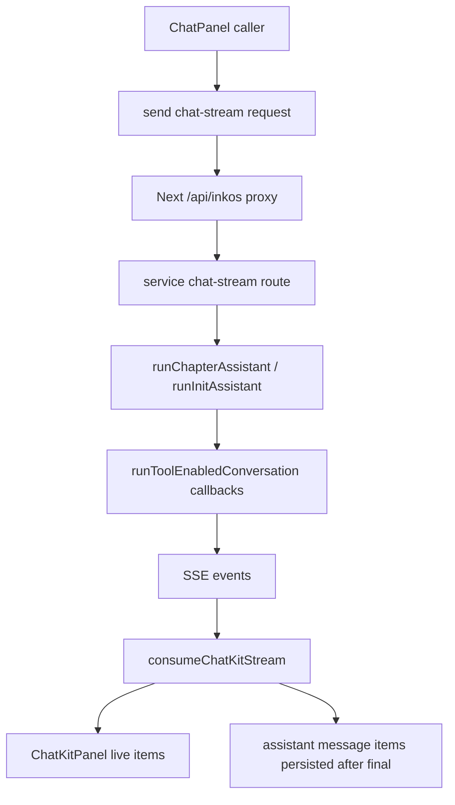

# chat-kit-framework design

## 0. 术语约定

| 术语 | 定义 | 防冲突结论 |
|---|---|---|
| ChatKit | `apps/web/app/ui/chat-kit/` 下的 mindfs 风格聊天 UI 组件族 | 已存在，继续沿用 |
| ChatKitPanel | 通用聊天框架外壳，负责时间线、思考块、工具卡、输入区和发送按钮 | 已扩展为通用 props |
| ChatPanel | 旧聊天壳兼容入口，章节/书籍旧调用点继续 import 它 | 保留为 adapter，内部委托 ChatKitPanel |
| ChatKitItem | ChatKit 时间线项，支持 user / assistant_text / thought / tool / status | 作为所有聊天入口统一内部模型 |
| ChatKit stream | `start/message_chunk/thought_chunk/tool_call/tool_call_update/final/done/error` SSE 事件协议 | 从 profile 扩展到 chapter/init |

## 1. 决策与约束

### 需求摘要

- 做什么：把当前满意的 profile ChatKit 变成通用聊天框架，并让章节对话、书籍工作台初始化对话、新建书籍初始化对话、控制台初始化对话都走同一套 SSE 时间线。
- 为谁：InkOS Web 内所有“用户输入 + 助手回答 + reasoning/工具卡/Markdown”聊天入口。
- 成功标准：章节/书籍聊天不再等 async job poll 完成后一次性显示，而是像 profile chat 一样实时显示正文、thinking 和工具卡；final 后工具卡仍保留在历史消息里。
- 明确不做：
  - 不删除旧 `/chat` async poll API，保留给兼容调用。
  - 不把章节写作、审计、续写等非聊天 job 改成 SSE。
  - 不引入 mindfs WebSocket / SessionHub。
  - 不改变书籍正文/简报的业务生成规则，只改变聊天传输和渲染路径。

### 复杂度档位

走“项目内部 UI + service API 扩展”档位；有前后端协议变化，但仅限现有 service/web 边界，不涉及对外 SDK。

### 关键决策

1. **ChatPanel 作为 adapter 保留**：旧调用点不批量改 import，但实际渲染统一走 ChatKit。
2. **新增 chat-stream，旧 chat 保留**：chapter/init 新增 `/chat-stream` SSE 路由；旧 `/chat` async poll 不删，避免破坏兼容调用。
3. **stream consumer 下沉到 ChatKit**：profile/chapter/init 共用 `consumeChatKitStream`，避免每个模块重复写 SSE parser。
4. **历史消息保存 items**：assistant 消息可保存最终 `ChatKitItem[]`，final 后仍能回放工具卡。
5. **init 标签协议由后端过滤**：init assistant 内部仍输出 `<reply_md>/<brief_md>`，stream 中只发送可见 reply markdown，final 再带回解析后的 `brief`。

## 2. 名词与编排

### 2.1 名词层

#### 现状

- `ChatKitPanel` 已服务 profile chat。
- `ChatPanel` 已是 ChatKit adapter。
- profile chat 使用 `/api/llm-profiles/:id/chat-stream`。
- chapter/init 仍主要通过 `/chat` 创建 async job，再 poll `/jobs/:id` 取最终 `reply/reasoning`。

#### 变化

- `ChatKitStreamEvent` 成为通用 SSE 事件类型，`ProfileStreamEvent` 保留为兼容别名。
- `consumeChatKitStream(response, baseMessages, { onFrame })` 成为统一 stream 消费器。
- `ChatPanel` 增加 `items?: ChatKitItem[] | null`，用于正在 streaming 的 live timeline 覆盖。
- chapter service 新增 `/api/books/:bookId/chapters/:chapter/chat-stream`。
- init service 新增 `/api/init-assistant/chat-stream`。
- Next web 代理新增对应 `/api/inkos/.../chat-stream` 路由。
- `runChapterAssistant` / `runInitAssistant` 透传 text/reasoning/tool callbacks，并返回 `toolTrace`。

#### 接口示例

```tsx
<ChatPanel
  messages={chatMessages}
  items={chatLiveItems}
  value={chatDraft}
  onSend={sendChapterChat}
/>
```

```ts
await fetch(`/api/inkos/books/${bookId}/chapters/${chapter}/chat-stream`, {
  method: "POST",
  body: JSON.stringify({ messages, profileId }),
});
```

### 2.2 编排层



#### 现状

- profile chat 已实时显示 chunks/thought/tool/final。
- chapter/init chat 在 UI 上已经用 ChatKit 外观，但传输仍是 job poll，无法显示实时工具时间线。

#### 变化

- chapter/init UI 发送时立即创建 base user message 和 live ChatKit items。
- service 每个 text/reasoning/tool callback 推送 SSE frame。
- 前端每收到 frame 就更新 `items`，final 后把 `content/reasoning/items` 保存进 assistant message。
- init assistant 的 final 额外带 `brief`，前端继续更新长期创作约束。

#### 流程级约束

- 取消语义：SSE 路由只监听 `req.aborted` 和 `res.close`，不用 `req.close`。
- 错误语义：stream 已打开后发送 `{ type: "error" }`；未打开时返回 JSON 400。
- 兼容性：旧 `/chat` 和 job poll API 保留，不作为新 ChatKit 入口默认路径。
- 持久化：历史消息可多一个 `items` 字段；发给模型时只发送 `role/content`。

### 2.3 挂载点清单

- `apps/service/src/llm-routes.ts` — 新增 chapter/init SSE route。
- `apps/service/src/llm-service.ts` — chapter/init assistant 透传 stream callbacks。
- `apps/web/app/api/inkos/**/chat-stream/route.ts` — 新增 Next SSE 代理。
- `apps/web/app/ui/chat-kit/consume-chat-kit-stream.ts` — 新增通用 stream consumer。
- `apps/web/app/ui/chat-panel.tsx` — adapter 支持 live items 覆盖。
- `apps/web/app/ui/book-chapters.tsx` — 章节聊天改走 stream。
- `apps/web/app/ui/book-workspace.tsx` / `create-book-launcher.tsx` / `inkos-console.tsx` — 书籍初始化聊天改走 stream。

### 2.4 推进策略

1. 协议骨架：新增通用 ChatKit stream event/consumer。
   - 退出信号：profile 可复用同一 consumer。
2. 后端 stream：新增 chapter/init chat-stream 路由和 service callback 透传。
   - 退出信号：路由能发送 text/thought/tool/final/error/done 事件。
3. Web 代理：新增 Next chat-stream 代理。
   - 退出信号：浏览器端可收到 `text/event-stream`。
4. UI 迁移：章节和书籍/init 调用点改用 stream，保存 final items。
   - 退出信号：旧聊天入口不再创建 init/chapter chat job。
5. 静态检查与提交。
   - 退出信号：TypeScript 语法/类型检查通过，提交 push。

### 2.5 结构健康度与微重构

##### 评估

- 文件级 — `llm-routes.ts` 已较大，但 SSE 路由和旧 route 同属 API 编排；本次新增局部 route，不做跨文件拆分。
- 文件级 — `book-chapters.tsx` / `book-workspace.tsx` 原本包含 job polling；本次删除聊天 poll 代码，降低局部复杂度。
- 目录级 — `chat-kit/` 已按组件/类型/转换函数分组；新增 `consume-chat-kit-stream.ts` 符合现有目录形态。

##### 结论：不做额外微重构

本次需要跨前后端协议同步，先完成行为闭环；`llm-routes.ts` 后续若继续膨胀，再单独走 `cs-refactor` 拆路由。

## 3. 验收契约

- 章节对话触发发送 → 前端请求 `/chat-stream`，实时显示正文/thinking/tool card，final 后历史仍保留工具卡。
- 书籍工作台智能初始化对话触发发送 → 请求 `/init-assistant/chat-stream`，实时显示 ChatKit 时间线，final 后同步 `authorBrief`。
- 创建书籍智能初始化对话触发发送 → 请求 `/init-assistant/chat-stream`，实时显示 ChatKit 时间线，final 后同步创建用 brief。
- 控制台智能初始化对话触发发送 → 请求 `/init-assistant/chat-stream`，不再创建 init assistant job。
- profile chat → 仍使用同一 ChatKit stream reducer，行为不退化。
- 明确不做反向核对：章节写作/审计/续写 job poll 不被改动；旧 `/chat` API 不删除。

## 4. 与项目级架构文档的关系

本 feature 把 `apps/web` 的聊天 UI 和 `apps/service` 的聊天流式协议收敛为 ChatKit stream。验收时建议在 `ARCHITECTURE.md` 的 web/service API 索引里补一句：ChatKit 是 Web 内统一聊天框架，chapter/init/profile chat-stream 是统一实时聊天协议。
