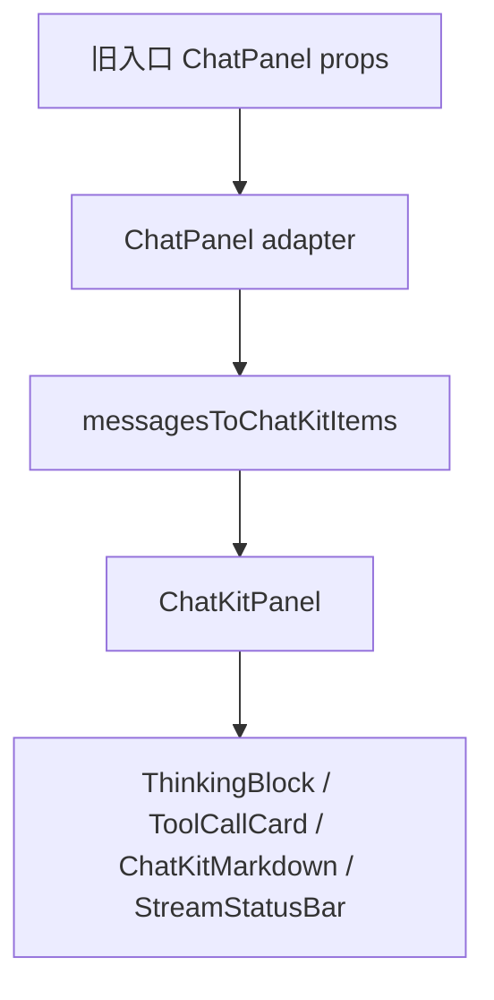

# chat-kit-framework design

## 0. 术语约定

| 术语 | 定义 | 防冲突结论 |
|---|---|---|
| ChatKit | `apps/web/app/ui/chat-kit/` 下的 mindfs 风格聊天 UI 组件族，已在 profile chat 验证 | 已存在，继续沿用 |
| ChatKitPanel | 通用聊天框架外壳，负责时间线、思考块、工具卡、输入区和发送按钮 | 已存在，扩展为通用 props |
| ChatPanel | 旧聊天壳，当前被章节/书籍/初始化入口引用 | 保留为兼容 adapter，内部委托 ChatKitPanel |
| ChatKitItem | ChatKit 时间线项，支持 user / assistant_text / thought / tool / status | 已存在，作为新框架统一内部模型 |

## 1. 决策与约束

### 需求摘要

- 做什么：把当前满意的 profile ChatKit 变成通用聊天框架，让章节对话和书籍相关对话入口都复用同一套 UI。
- 为谁：InkOS Web 内所有“用户输入 + 助手回答 + reasoning/工具卡/Markdown”聊天入口。
- 成功标准：旧 `ChatPanel` 使用者不需要各自维护 Markdown/Reasoning/输入区实现，视觉和 profile ChatKit 保持一致。
- 明确不做：
  - 不把章节/书籍后端从 async poll 改成 SSE。
  - 不改变 chapter-chat / init-assistant 的 API payload 和持久化格式。
  - 不删除旧 `ChatPanel` 导出，避免一次性改爆调用点。
  - 不引入 mindfs WebSocket / SessionHub。

### 复杂度档位

走“项目内部 UI 组件”默认档位；无对外 SDK、高并发或跨进程协议偏离。

### 关键决策

1. **ChatPanel 作为 adapter 保留**：比全量替换每个 import 风险低，所有旧入口会自动用 ChatKit，后续可逐步改 import。
2. **不改后端协议**：章节/书籍入口仍按原 async job/poll 工作，只把最终消息映射成 ChatKitItem；profile SSE timeline 保持现状。
3. **ChatKitPanel 补齐旧 ChatPanel 的壳层 props**：`minHeight`、输入行数、`sendText`、`footerRight`，保证旧入口行为不丢。

## 2. 名词与编排

### 2.1 名词层

#### 现状

- `ChatKitPanel`：接收 `items/value/onChange/onSend/sending/topBar/footerLeft/maxHeight/containerStyle`，服务 profile chat。
- `ChatPanel`：自己定义 `ChatPanelMessage`、Markdown renderer、ReasoningBlock、气泡布局、输入区，被章节/书籍/初始化入口引用。
- `messagesToChatKitItems`：把 `{ role, content, reasoning }` 历史消息转换成 ChatKit timeline，但未使用可选 message id。

#### 变化

- `ChatKitPanel` 增加旧壳兼容 props：
  - `footerRight?: ReactNode`
  - `minHeight?: number | string`
  - `inputMinRows?: number`
  - `inputMaxRows?: number`
  - `sendText?: string`
- `ChatPanel` 改成兼容 adapter：
  - 保留原 `ChatPanelMessage` 和 props。
  - 内部调用 `messagesToChatKitItems(props.messages)`。
  - 渲染委托给 `ChatKitPanel`。
- `messagesToChatKitItems` 接受 `id?: string`，尽量保留旧消息稳定 key。

#### 接口示例

```tsx
// 来源：apps/web/app/ui/chat-panel.tsx ChatPanel
<ChatPanel
  messages={chatMessages}
  value={chatDraft}
  onChange={setChatDraft}
  onSend={sendChapterChat}
  sending={chatting}
  footerRight={<Button>清空</Button>}
  sendText="发送给助手"
/>
```

内部等价于：

```tsx
// 来源：apps/web/app/ui/chat-kit/ChatKitPanel.tsx ChatKitPanel
<ChatKitPanel
  items={messagesToChatKitItems(chatMessages)}
  value={chatDraft}
  onChange={setChatDraft}
  onSend={sendChapterChat}
  sending={chatting}
/>
```

### 2.2 编排层



#### 现状

- profile chat：直接使用 `ChatKitPanel`。
- chapter/book/init：使用旧 `ChatPanel`，重复 Markdown 和 reasoning UI。
- 后端协议：profile 是 SSE；chapter/init 仍是 async job + poll。

#### 变化

- 旧入口不改业务发送流程，仍传 `messages/value/onSend`。
- `ChatPanel` 只做 adapter，不再拥有独立 Markdown/Reasoning 渲染。
- 所有聊天正文最终进入同一个 ChatKit 时间线渲染路径。

#### 流程级约束

- 错误语义不变：旧入口仍由各自页面展示 `Alert`。
- 持久化不变：旧消息数组结构仍是 `{ role, content, reasoning }`。
- 工具卡能力只在有 `ChatKitItem.items/tool` 的入口可见；本次不要求 chapter/init 后端产生 tool timeline。

### 2.3 挂载点清单

- `apps/web/app/ui/chat-panel.tsx` — 修改：旧公共聊天入口改为 ChatKit adapter。
- `apps/web/app/ui/chat-kit/ChatKitPanel.tsx` — 修改：成为通用聊天框架外壳，补旧 props。
- `apps/web/app/ui/chat-kit/messages-to-items.ts` — 修改：作为所有非 SSE 历史消息的统一转换入口。

### 2.4 推进策略

1. 静态框架：扩展 ChatKitPanel props，保持 profile 调用兼容。
   - 退出信号：profile 现有调用无需改动。
2. Adapter 收敛：ChatPanel 委托 ChatKitPanel。
   - 退出信号：旧 ChatPanel 调用点无需批量改 import。
3. 消息转换：补稳定 id 支持。
   - 退出信号：旧消息 id 不被丢弃，历史 key 更稳定。
4. 静态检查与提交。
   - 退出信号：TypeScript 语法/类型检查通过，提交 push。

### 2.5 结构健康度与微重构

##### 评估

- 文件级 — `apps/web/app/ui/chat-panel.tsx`：383 行，混合 Markdown、Reasoning、布局、输入区；本次通过 adapter 收敛职责，属于功能本身。
- 文件级 — `apps/web/app/ui/chat-kit/ChatKitPanel.tsx`：138 行，职责集中；补 props 不需要拆文件。
- 目录级 — `apps/web/app/ui/chat-kit/`：9 个文件，已经按组件/类型/转换函数分组；本次不新增新文件。

##### 结论：不做额外微重构

`ChatPanel` 收敛为 adapter 是本 feature 主体，不单独作为“只搬不改行为”的前置微重构；`chat-kit/` 目录暂不重组。

## 3. 验收契约

- 章节对话触发发送 → UI 使用 ChatKit 气泡/Markdown/ThinkingBlock 样式，不再使用旧 ChatPanel 自绘实现。
- 书籍智能初始化对话触发发送 → UI 使用 ChatKit 气泡/Markdown/ThinkingBlock 样式。
- 创建书籍智能初始化对话触发发送 → UI 使用 ChatKit 气泡/Markdown/ThinkingBlock 样式。
- profile chat → 现有 ChatKit 行为不退化，工具卡仍默认折叠，Markdown 表格仍能渲染。
- 明确不做反向核对：service 中不新增 chapter/init SSE 路由；chapter/init API payload 不新增 stream event 字段。

## 4. 与项目级架构文档的关系

本 feature 把 `apps/web` 的聊天 UI 收敛为 ChatKit 组件族，属于 Web UI 结构变化。验收时建议在 `ARCHITECTURE.md` 的 `apps/web` 索引里补一句：ChatKit 是 Web 内统一聊天框架，`ChatPanel` 是兼容 adapter。
