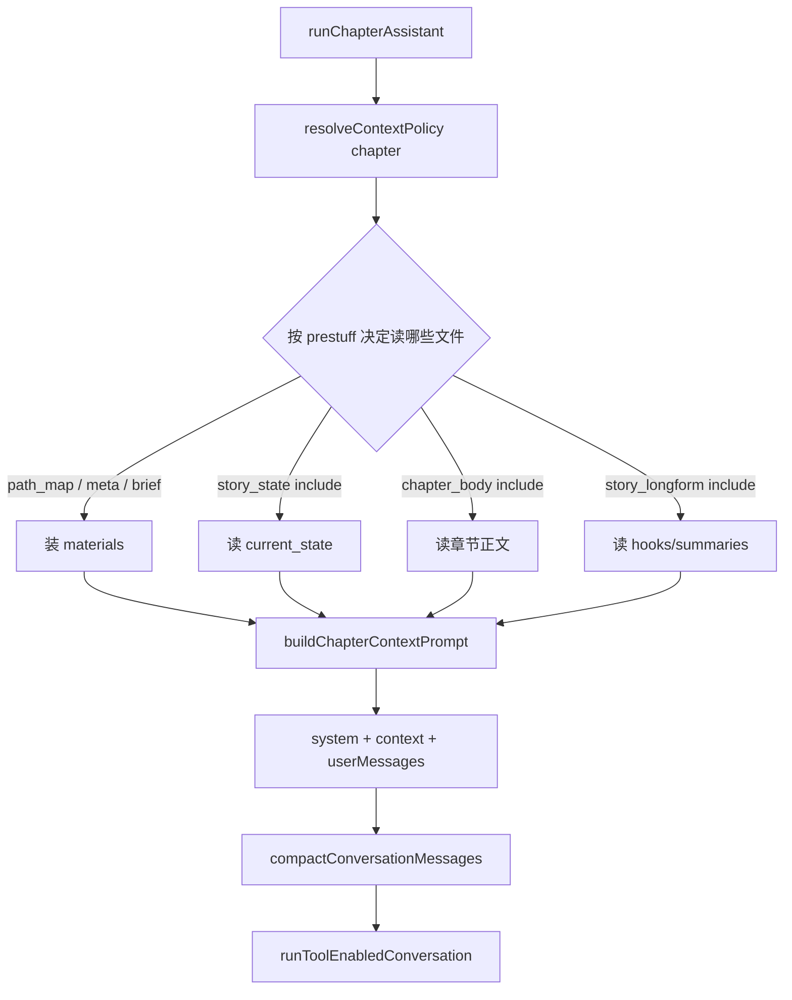

# ctx-chapter-prestuff design

## 0. 术语约定

| 术语 | 定义 | 防冲突 |
|---|---|---|
| **ChapterContextMaterials** | 组装首包所需的原始材料（路径、元数据、可选正文/story 文本） | 新概念；仅 service/context |
| **buildChapterContextPrompt** | 按 `ContextPolicy.prestuff` 把材料拼成 context 用户消息 | 新概念 |
| **chapter_meta** | 轻量书/章元数据（书名、题材、平台、章号、状态、审计摘要）——**始终预塞**，不进 PrestuffRule 表 | 本 feature 引入；非 roadmap blockId |
| **path_map / story_state / chapter_body / story_longform** | 沿用 `ctx-policy-core` blockId | 不变 |

## 1. 决策与约束

### 需求摘要

- **做什么**：`runChapterAssistant` 用 `resolveContextPolicy("chapter")` + 新组装函数生成首包 context；遵守 prestuff 规则，默认不塞全文/长 story。
- **为谁**：章节对话用户 / 降上游 token、逼模型工具读文件。
- **成功标准**：同输入下首包不再含 `当前章节正文` 全文块；含路径地图；`story_state` 受 maxChars；仍可通过 `read_text_file` / `write_text_file` 改章（行为上不删工具）。
- **明确不做**：
  - 不改 LoopCompressor / WriteIntegrity / claim 逻辑
  - 不改 profile / init 组装
  - 不退役 `compactConversationMessages`（仍可在组装后调用）
  - 不改 Web UI；不改工具列表本身

### 复杂度档位

走默认档位，无偏离。

### 关键决策

1. **组装落在 `apps/service/src/context/`**（如 `build-chapter-context.ts`），`runChapterAssistant` 只改接线，不在 1500+ 行文件里继续堆拼接逻辑。  
2. **block 映射（硬）**：
   - `path_map`：bookDir / chapterFile / storyDir / authorBriefPath / 状态卡路径 / chapterFiles / storyFiles 列表（有 `defaultInclude`）
   - `story_state`：仅 `current_state.md` 正文，截断到 `maxChars`（默认 1500）
   - `chapter_body`：`defaultInclude=false` → **不**加入「当前章节正文」块；也不为预塞去 `slice(0,12000)`
   - `story_longform`：`false` → **不**预塞 `pending_hooks` / `chapter_summaries` / 其它长 story 全文  
3. **`chapter_meta` 始终预塞**：书名/题材/平台/章号/状态/审计摘要（短）；`authorBrief` 视为创作约束短文本，**截断到 1500 字符始终带**（假设：约束丢了比正文丢了更伤；若 review 反对可改为仅 path）。  
4. **未包含的材料可不读盘**：`chapter_body`/`story_longform` 关闭时，跳过对应 `readFile`（省 I/O）；工具仍可按需读。  
5. **system prompt 加一句**：明确「首包可能未含章节正文，改前必须 `read_text_file`」。  
6. **仍调用** `compactConversationMessages(..., { mode: "chapter" })`——本 feature 只减预塞，不替换旧压缩。  
7. **被拒**：在 policy 为 false 时仍「偷偷」塞 2k 正文「以防万一」。

### 前置依赖

- `ctx-policy-core`（done）

## 2. 名词与编排

### 2.1 名词层

**现状**

- `runChapterAssistant`（`llm-service.ts`）硬编码 `contextPrompt`：正文最多 12000、伏笔 2500、摘要 3000、文件列表、状态卡全文等。
- `ContextPolicy` / `resolveContextPolicy` 已存在但无人调用。

**变化**

| 动作 | 内容 |
|---|---|
| 新增 | `ChapterContextMaterials`、`buildChapterContextPrompt(policy, materials) → string` |
| 修改 | `runChapterAssistant`：解析 policy → 按规则装填 materials → 用 builder 替换手写 contextPrompt |
| 不变 | CHAPTER_CHAT_TOOLS、executeChapterChatTool、compaction 入口签名 |

**接口示例**

```ts
const policy = resolveContextPolicy("chapter");
const prompt = buildChapterContextPrompt(policy, {
  bookId, bookTitle, genre, platform,
  chapterNumber, chapterTitle, status, auditText,
  bookDir, chaptersDir, storyDir, chapterFile,
  authorBriefPath, authorBrief,           // brief 文本可空
  currentStatePath, currentState,         // 仅当 story_state include 时需要非空
  chapterFiles, storyFiles,
  // chapterContent / pendingHooks / chapterSummaries：仅当对应 block include 时传入
});

// chapter 默认 policy 下：
// prompt 含：chapter_meta + path_map + story_state(≤1500)
// prompt 不含：`当前章节正文`、伏笔池全文、章节摘要全文
```

// 来源：roadmap §4.1 + `llm-service.ts` `runChapterAssistant`

### 2.2 编排层



**现状**：读全量材料 → 拼大 context → compact → tools。

**变化**：先 policy → 条件读盘 → builder → 其后不变。

**流程级约束**

- builder 纯函数；缺材料且 block 要求 include 时：该块输出「（暂无）」或跳过，不得抛导致整章对话失败（与现网「暂无」风格一致）。
- 可观测：`logInfo("chapter.chat.prestuff", { includedBlocks, omittedBlocks, contextChars })`。
- 错误：读盘失败对关闭的 block 可忽略；对开启的 block 沿用现网（失败则该段空/暂无），不把整次 chat 打成 500——与现行为对齐，implement 对照现 try 边界。

### 2.3 挂载点清单

1. **`runChapterAssistant` 接线**：改为调用 `resolveContextPolicy` + `buildChapterContextPrompt` — 删掉则预塞行为回到旧硬编码（或编译失败）。  
2. **`context/build-chapter-context.ts`（名可微调）导出** — 组装实现挂载点。  
3. **system prompt 新增约束句** — 删掉则模型更易在未 read 时嘴炮改文。  
4. **日志事件 `chapter.chat.prestuff`** — 可观测挂载。

不挂：HTTP 路由、Web、env 新键（沿用 core 的 INKOS_CTX_*）、工具 schema。

### 2.4 推进策略

1. **计算节点**：实现 `buildChapterContextPrompt` + materials 类型 → 单测：默认 policy 不含正文/longform、含 path_map  
2. **编排接线**：`runChapterAssistant` 条件读盘 + 调用 builder → typecheck  
3. **system 提示**：补「未预塞正文须 read」→ 文案在单测或快照中可断言  
4. **可观测**：打 prestuff 日志  
5. **回归**：既有 service 测试 + 新 prestuff 单测；手工或单测断言 context 字符串约束  

### 2.5 结构健康度与微重构

##### 评估

- 文件级 — `llm-service.ts` ~1565 行，职责混杂；本 feature 会改 `runChapterAssistant` 一处编排  
- 目录级 — `context/` 已存在且健康；再增 1 个组装文件合理  
- compound：无 convention 命中  

##### 结论：不做单独微重构前置

原因：把组装逻辑**新建**到 `context/` 即是本 feature 主体（不是「只搬不改」的前置步）。不在本 feature 拆分整个 `llm-service.ts`。

##### 超出范围的观察

- `llm-service.ts` 整体拆分 → 建议后续 `cs-refactor` 或 Bridge feature 顺带，不阻塞本最小闭环。

## 3. 验收契约

### 关键场景清单

| # | 输入 / 触发 | 期望 |
|---|---|---|
| N1 | 默认 policy 调用 builder（含正文材料也不应输出） | 输出**不含**「当前章节正文」标题块 |
| N2 | 默认 policy | 输出**含**路径/chapterFile/文件列表（path_map） |
| N3 | story_state 长文 >1500 | 输出状态卡截断 ≤ maxChars |
| N4 | story_longform=false | 输出不含伏笔池/章节摘要正文块 |
| B1 | chapter_body 规则被测成 include=true 且 maxChars=100 | 可含正文但 ≤100（证明 builder 尊重规则） |
| E1 | grep `runChapterAssistant` | 使用 `resolveContextPolicy` / `buildChapterContextPrompt` |
| E2 | 工具列表仍含 read/write_text_file | 未删除 |

### 明确不做 — 反向核对

- 无 LoopCompressor / claim guard 新逻辑  
- profile/init 组装代码无本次改动（或仅共享 import 无行为变）  
- `compaction.ts` 主算法不改  

## 4. 与项目级架构文档的关系

- 回写 `ARCHITECTURE.md`：章节对话首包由 ContextPolicy 驱动组装；正文默认不预塞。  
- 无新对外 HTTP 契约。
