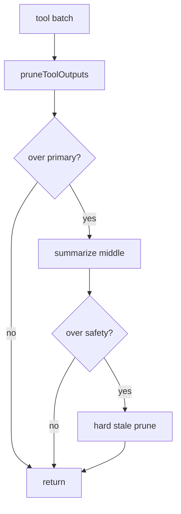

# ctx-loop-summarizer design

## 0. 术语约定

| 术语 | 定义 | 防冲突 |
|---|---|---|
| **maybeCompressConversation** | prune → 可选 summarize → safety 强剪 | roadmap §4.2 |
| **middle summary** | 用一条 user 消息替换头尾之间的旧轮次 | 不删未保护的工具配对半截 |
| **summarizeMiddle** | 注入的摘要函数（生产用 chatCompletion） | 失败走本地 extractStructuredSummary + 强剪 |

## 1. 决策与约束

### 需求摘要

- **做什么**：loop 内在 prune 后若仍超 primary，折叠 middle 为结构化摘要；仍超 safety 再强剪旧 tool；失败打日志并回退。
- **为谁**：`runToolEnabledConversation`。
- **成功标准**：超阈值后消息变短且含摘要标记；`loopCompressDisabled` 旁路；摘要抛错不静默丢痕迹。
- **明确不做**：不退役进模前 compaction；不改 WriteIntegrity；不改 provider 协议。

### 复杂度档位

走默认档位。

### 关键决策

1. 顺序固定：prune →（仍≥primary）summarize middle →（仍≥safety）stale 强剪。
2. middle 折叠：head（system[+首 user]）+ 一条 `[conversation summary]` user + tail（按 tailTokens）。
3. 摘要优先调用注入的 `summarizeMiddle`；失败则 `extractStructuredSummary` 本地兜底，`stats.summaryUpdated` 仍可为 true，并记 `summarizeFailed` 日志字段。
4. 旁路：`loopCompressDisabled` → 原样。

### 前置依赖

`ctx-tool-output-prune` done。

## 2. 名词与编排

### 2.1 名词层

**现状**：仅 `pruneToolOutputs`。

**变化**：新增 `maybeCompressConversation`；`CompressResult.triggered` 含 `summarize`。

### 2.2 编排层

### 2.3 挂载点

1. `context/maybe-compress-conversation.ts`
2. `runToolEnabledConversation` 用 maybeCompress 替换纯 prune
3. barrel 导出

### 2.4 推进策略

1. maybeCompress + 单测 → 退出：primary/safety/disabled/失败回退
2. 接线 + chatCompletion 摘要 → typecheck
3. 验收对照

### 2.5 结构健康度

新文件进 context/。不做微重构前置。

## 3. 验收契约

| # | 触发 | 期望 |
|---|---|---|
| N1 | 超 primary | triggered 含 summarize 或 prune；出现 summary 消息 |
| N2 | disabled | triggered none |
| N3 | summarize 抛错 | 本地摘要兜底；不抛穿；可观测失败 |
| B1 | 超 safety | 再压旧 tool |
| E1 | 接线 | runToolEnabledConversation 调 maybeCompress |

反向：不删 compaction.ts；不改 claim 逻辑。

## 4. 架构关系

回写 LoopCompressor：摘要阶段已落地。
