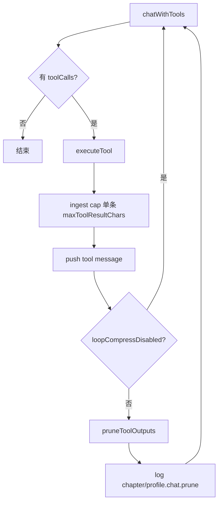

# ctx-tool-output-prune design

## 0. 术语约定

| 术语 | 定义 | 防冲突 |
|---|---|---|
| **Tool output prune** | 不调用摘要模型，只裁剪 / 缩短 conversation 里的 `role:tool` 内容 | Hermes 压缩四阶段的 Phase 1 |
| **ingest cap** | 单条 tool 结果写入 conversation 前截到 `maxToolResultChars` | 对应 policy.budget |
| **stale prune** | 保护头尾后，把中间旧 tool 内容压到 `staleToolResultChars` | 对应 policy.budget |
| **pruneToolOutputs** | 本 feature 主函数（纯剪枝，不 summarize） | 后续 `maybeCompressConversation` 会先调它 |
| **loopCompressDisabled** | policy 旁路；为 true 时跳过剪枝 | 已有字段 |

## 1. 决策与约束

### 需求摘要

- **做什么**：在 tool loop 内对工具回灌做 Hermes 式廉价剪枝；超主阈值时压旧 tool；单条入库封顶。
- **为谁**：章节 / profile / init 共用的 `runToolEnabledConversation`（一次接线全受益）。
- **成功标准**：构造超长 tool 对话时，剪枝后估算 token 下降且头尾保留；`INKOS_DISABLE_LOOP_COMPRESS=true` 时不剪。
- **明确不做**：
  - 不做 LLM 中间摘要（归 `ctx-loop-summarizer`）
  - 不改 WriteIntegrity / claim（归 `ctx-write-claim-guard`）
  - 不退役 `compaction.ts` 进模前路径
  - 不改 `provider.ts`

### 复杂度档位

走默认档位。

### 关键决策

1. **算法对齐 Hermes Phase 1**：先 ingest cap → 估 token → 若 `>= totalTokens * compressPrimaryRatio`（或 `>= safetyRatio`）则对「非头、非尾」的旧 `tool` 消息做 stale 压缩。  
2. **头保护**：至少保留第一条 `system`；若存在紧随其后的首条 context `user`，一并保护（对齐 chapter 布局）。  
3. **尾保护**：从末尾累加，保留约 `tailTokens` 估算额度内的消息（含最近 tool）；这些不做 stale 压扁。  
4. **截断标记**：被剪内容替换为原长提示 + 截断正文，例如 `[tool output truncated, originalChars=N]\n` + head/tail 片段；**旧 tool 用留尾**（与 prestuff longform 一致，保留最近读到的内容）。  
5. **触发点**：每轮 tool 批量 `push` 进 conversation **之后**、下一轮 `chatWithTools` **之前**调用 `pruneToolOutputs`。  
6. **旁路**：`policy.loopCompressDisabled` 或显式 skip → 原样返回，`triggered: "none"`。  
7. **policy 来源**：`runToolEnabledConversation` 增加可选 `contextMode?: ChatContextMode`（默认 `"chapter"`），内部 `resolveContextPolicy(mode)`；profile/init 调用处传入对应 mode（若现调用未传，默认 chapter 预算——**假设可接受**；或强制三处都传，review 定）。  
8. **被拒**：只在进 `chatWithTools` 前剪、loop 内不剪；静默丢整条 tool 消息（破坏 toolCallId 配对）。

### 前置依赖

- `ctx-policy-core`（done）

## 2. 名词与编排

### 2.1 名词层

**现状**

- `runToolEnabledConversation` 把完整 `toolResult` 推进 conversation，无长度上限、无 loop 内剪枝。
- `estimateTokens` 在 `compaction.ts`；可复用。
- `AgentMessage` 含 `role: "tool"`（`packages/core` provider）。

**变化**

| 动作 | 内容 |
|---|---|
| 新增 | `pruneToolOutputs(input) → PruneResult`（落 `context/`） |
| 新增 | `PruneResult`: messages + stats（triggered / before / after / prunedToolResults） |
| 修改 | `runToolEnabledConversation`：每轮 tool 后调用 prune；可选 `contextMode` |
| 复用 | `ContextPolicy.budget.*`、`estimateTokens` |

**接口示例**

```ts
interface PruneInput {
  messages: AgentMessage[];
  policy: ContextPolicy;
}

interface PruneResult {
  messages: AgentMessage[];
  stats: {
    triggered: "none" | "prune" | "safety";
    beforeTokens: number;
    afterTokens: number;
    prunedToolResults: number; // 被改写的 tool 条数
  };
}

function pruneToolOutputs(input: PruneInput): PruneResult;

// 例：3 条超长 tool，超 primary → 中间旧 tool 被压到 staleToolResultChars
// 头 system + 尾最近消息保留全文（在 tail 预算内）
```

### 2.2 编排层



**现状**：C → push 全文 → 下一轮。

**变化**：D 封顶 + G 条件剪旧。

**流程级约束**

- **不得删除** tool 消息，只改 `content`（保持 toolCallId 配对）。  
- 纯函数剪枝（除日志在接线层）；可单测。  
- safety：`before >= total * safetyRatio` 时 `triggered: "safety"`，可对中间 tool 更激进（如 stale=0 只留标记）——**本 design 定：safety 时 stale 目标改为 `min(staleToolResultChars, 120)`**。  
- 可观测：`logInfo("*.chat.tool_prune", stats)`。

### 2.3 挂载点清单

1. `context/prune-tool-outputs.ts`（名可微调）导出 `pruneToolOutputs`  
2. `runToolEnabledConversation` 内 tool 回灌后调用  
3. 日志事件 `*.chat.tool_prune`  
4. （可选）调用方传入 `contextMode` — profile/init/chapter  

### 2.4 推进策略

1. 实现 `pruneToolOutputs` + 单测（封顶 / 超阈值剪旧 / 旁路 / 不删消息）  
2. 接线 `runToolEnabledConversation`  
3. 日志  
4. 验收对照  

### 2.5 结构健康度与微重构

##### 评估

- 新文件进 `context/`；`llm-service` 仅 loop 内加数行  
- compound：无  

##### 结论：不做微重构前置

##### 超出范围的观察

- `runToolEnabledConversation` 仍与 claim 警告耦在同函数 → 留给 claim-guard / refactor。

## 3. 验收契约

| # | 触发 | 期望 |
|---|---|---|
| N1 | 单条 tool 结果 > maxToolResultChars | 写入后 content 长度 ≤ cap + 标记开销合理上限 |
| N2 | 多条旧 tool 使总量 ≥ primary 阈值 | prunedToolResults ≥ 1；afterTokens < beforeTokens；头 system 未改 |
| N3 | loopCompressDisabled | 不剪，triggered=none |
| B1 | 仅尾部有 tool 且在 tail 预算内 | 可不剪这些 tool |
| E1 | grep | runToolEnabledConversation 调用 pruneToolOutputs |
| E2 | tool 消息条数剪前后一致 | 只改 content |

反向：无 summarize LLM 调用；不改 compaction 算法正文。

## 4. 与项目级架构文档的关系

- 回写：LoopCompressor 剪枝阶段已落地；与 Hermes Phase 1 对齐；摘要未上。
