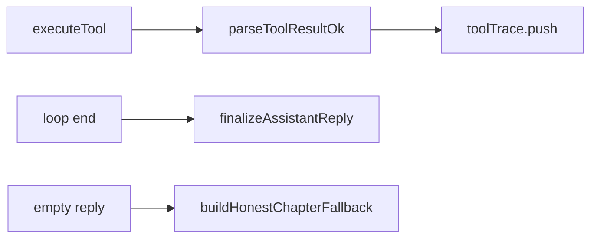

# ctx-write-claim-guard design

## 0. 术语约定

| 术语 | 定义 | 防冲突 |
|---|---|---|
| **WriteIntegrity** | 以 tool 结果 `ok` 判定写入成功，约束回复装订 | roadmap 模块名 |
| **ToolTraceItem** | `{ name, args, ok, error? }` | 替换仅 name/args 的旧 trace |
| **hasSuccessfulWrite** | 写工具且 `ok===true` | 非「调过写工具」 |
| **finalizeAssistantReply** | 按 trace 追加警告 / 成功记录 | 装订出口 |

## 1. 决策与约束

### 需求摘要

- **做什么**：解析 tool JSON 的 `ok`；假声称追加警告；执行记录与空回复 fallback 仅认成功写。
- **为谁**：`runToolEnabledConversation`（chapter/profile/init 共用出口）+ chapter 空回复 fallback。
- **成功标准**：失败写仍说「已修改」→ 有警告；无成功写 → fallback 不出现「已完成修改/写回」；成功写 → 执行记录只列成功项。
- **明确不做**：不改 tool JSON 字段名；不做 LLM 摘要 / prune；不改 UI；不退役 compaction。

### 复杂度档位

走默认档位。

### 关键决策

1. 写工具集：`write_text_file` / `move_path` / `delete_path`。
2. `parseToolResultOk`：能解析 JSON 且 `ok===true` → true；否则 false（含非 JSON）。
3. claimMarkers 沿用现有中文词表；逻辑改为对照 `hasSuccessfulWrite`。
4. fallback：有成功 `write_text_file` 才说写回完成；仅失败写 → 诚实失败文案。

### 前置依赖

无（可与已完成条目并行）。

## 2. 名词与编排

### 2.1 名词层

**现状**：`toolTrace` 在 execute 前 push，无 `ok`；`hasWriteToolCall` 只看 name；fallback 见写工具名即声称完成。

**变化**：新增 `write-integrity.ts`（parse / finalize / fallback 文案）；trace 执行后带 `ok`；出口走 `finalizeAssistantReply`。

```ts
interface ToolTraceItem {
  name: string;
  args: Record<string, unknown>;
  ok: boolean;
  error?: string;
}
function parseToolResultOk(content: string): boolean;
function hasSuccessfulWrite(trace: ReadonlyArray<ToolTraceItem>): boolean;
function finalizeAssistantReply(input: {
  reply: string;
  toolTrace: ReadonlyArray<ToolTraceItem>;
  reachedMaxTurns: boolean;
}): string;
function buildHonestChapterFallback(toolTrace: ReadonlyArray<ToolTraceItem>): string;
```

### 2.2 编排层



**现状 → 变化**：execute 前 push → 后 push + ok；内联警告逻辑 → `finalizeAssistantReply`；chapter fallback 改诚实。

流程级约束：失败写不得进「工具执行记录」；无成功写不得出假完成 fallback。

### 2.3 挂载点

1. `context/write-integrity.ts` 导出
2. `runToolEnabledConversation` trace + finalize
3. `runChapterAssistant` 空回复 fallback
4. barrel `context/index.ts`

### 2.4 推进策略

1. 计算节点：write-integrity + 单测 → 退出：ok 解析 / finalize / fallback 场景过
2. 编排接线：runToolEnabledConversation + chapter fallback → 退出：typecheck
3. 验收对照 → 退出：第 3 节证据齐

### 2.5 结构健康度与微重构

新文件进 `context/`；`llm-service` 只换调用。结论：不做微重构前置。超出范围：`runToolEnabledConversation` 仍偏胖 → 留给后续 refactor。

## 3. 验收契约

| # | 触发 | 期望 |
|---|---|---|
| N1 | 写工具返回 ok:false，回复含「已修改」 | 追加未成功写入警告 |
| N2 | 写工具 ok:true | 执行记录含该路径 |
| N3 | 仅失败写，空回复走 fallback | 无「已完成修改/写回相关文件」 |
| B1 | 非 JSON tool 结果 | ok 视为 false |
| E1 | grep | finalize / parse 被接线 |

反向：无 summarize；不改 provider。

## 4. 与项目级架构文档的关系

回写 WriteIntegrity：声称与 fallback 仅认 `ok===true`。
