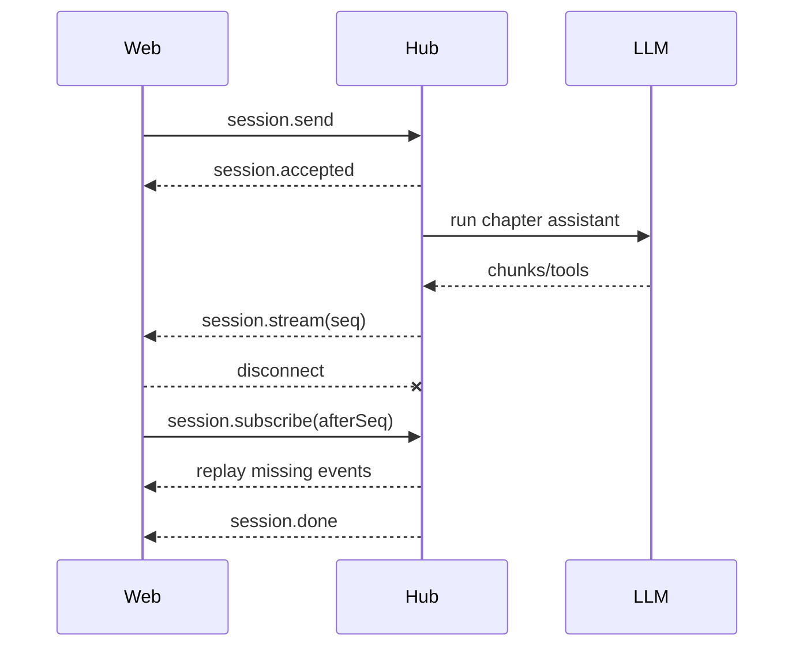

# chapter-chat-websocket design

## 0. 术语约定

| 术语 | 定义 | 防冲突结论 |
|---|---|---|
| ChapterChatStreamHub | Service 内章节流会话与事件缓存 | 对齐 Mindfs StreamHub，仅服务章节试点 |
| stream session | 一次章节消息生成的运行会话 | 与持久化 chat session 分开 |
| replay | 按 `afterSeq` 补发断线期间事件 | 不重发用户提示词 |
| recovery | 模型流失败后的 `continue` 恢复 | 工具已启动时禁用，避免重复副作用 |

## 1. 决策与约束

- 做什么：章节对话优先使用 WebSocket，会话脱离连接运行，支持断线重连、事件重放和安全 `continue`。
- 为谁：移动端或不稳定网络下使用章节对话的用户。
- 成功标准：断线不终止任务；重连只补缺失事件；部分输出不消失；无工具副作用时可自动恢复。
- 明确不做：不迁移 profile/init 等聊天；不删除现有 SSE；不在工具已启动后自动重试。
- 健壮性 = L3；结构 = modules；可测试性 = tested；兼容性 = backward-compatible。
- 章节 WebSocket 握手失败时回退 SSE；已接受的 WebSocket 会话禁止回退重发。

## 2. 名词与编排

### 2.1 名词层

现状：章节对话是一次性 POST SSE，临时状态只存在当前响应中。

变化：新增 `session.send / subscribe / cancel` 客户端消息，以及 `session.accepted / stream / done / error` 服务端消息。`session.stream` 包含递增 `seq` 和现有 ChatKit event。

示例：连接断开前收到 `seq=4`，重连发送 `{type:"session.subscribe", afterSeq:4}`，服务端只重放 `seq>4`。

### 2.2 编排层

现状：连接关闭会 abort SSE 任务，无法恢复。

变化：Hub 持有任务、AbortController、订阅者和有界事件列表；连接关闭只移除订阅者。模型流在已有文本且没有工具时最多恢复 3 次，间隔默认 30 秒并发送 `recovery` 状态。

流程约束：同一 stream session 只运行一次；取消显式中止；事件最多保留 2000 条，会话结束一小时后清理。

### 2.3 挂载点清单

- Service HTTP upgrade `/api/chapter-chat/ws`：新增。
- Web 配置接口 `/api/inkos/chapter-chat-ws-config`：新增。
- 章节对话发送入口：改为 WebSocket 优先、SSE 回退。
- `INKOS_PUBLIC_SERVICE_URL`：可选公开 Service 地址配置。

### 2.4 推进策略

1. 协议与 Hub：会话可独立运行并缓存事件。
2. 重放与恢复：断线按序补发，无工具时 `continue`。
3. Web 接入：章节入口迁移，SSE 保持回退。
4. 验证：覆盖断线重放、恢复、类型与既有测试。

### 2.5 结构健康度与微重构

- 文件级：`llm-routes.ts` 已超过 1200 行，因此 WebSocket Hub 新建独立模块，不继续塞入路由文件。
- 文件级：`book-chapters.tsx` 较长，但本次只替换发送编排，不拆组件。
- 目录级：Service 根目录较平，但 Hub 是服务编排模块；Web ChatKit 已有明确目录。

结论：不做额外微重构；新职责落独立模块。

## 3. 验收契约

- 正常发送 → 收到完整 ChatKit 时间线与最终回复。
- 首连接收到部分内容后断开 → 服务端继续；重连只收到缺失序号事件。
- 模型在无工具调用时部分失败 → 显示 recovery，随后用 `continue` 恢复。
- WebSocket 握手失败 → 自动走原 SSE。
- 已接受会话失败 → 不走 SSE 重发，保留部分输出并显示错误。
- profile/init 聊天和旧 SSE API 不发生行为变化。

## 4. 与项目级架构文档的关系

验收后补充 Service 的 ChapterChatStreamHub 与章节 WebSocket 试点说明。
